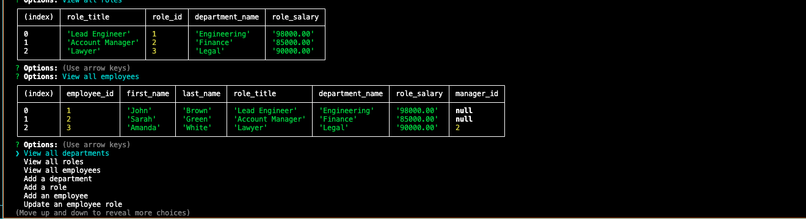

# Staff_Navigator_SQL

Staff Navigator 

Staff Navigator is a command-line application that allows you to efficiently manage your company's employees, their managers, and their job roles. With this application, you can easily locate employees, view their managers, and identify their roles within the organization.

Table of Contents

Features
Installation
Usage
Screenshots
Contributing
License
Features

View Employees: Easily view a list of all employees in the company along with their job roles and managers.
Locate Managers: Quickly locate the manager of any employee.
Identify Job Roles: Access information about the job role of each employee.
Add New Employees: Seamlessly add new employees to the database.
Update Employee Information: Modify employee details such as their job role and manager.

Installation

Clone this repository to your local machine using the following command:
git clone SSH - git@github.com:kianta95/Staff_Navigator_SQL.git
cd Staff_Navigator_SQL
npm install
run the application: node server.js

Usage

Start the application by running node server.js in your terminal.
Use the arrow keys to navigate through the menu options.
Select the desired action from the menu (e.g., View Employees, Add Employee, Update Employee, etc.).
Follow the prompts to complete the chosen action.
Enjoy efficient management of your company's employees!

